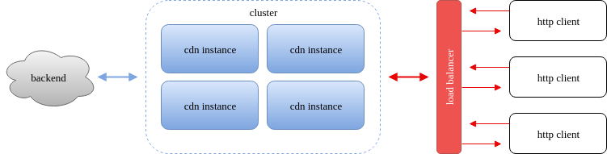

<p align="center">
    
</p>

# cdn

*Multi-protocol Caching Layer for any HTTP backend*

This project aims to provide an caching layer for any HTTP backend, e.g. Amazon S3.

<p align="center">
   
</p>

## Usage

```
$ ./cdn --help
Usage:
  cdn [flags]

Flags:
      --backend string   Backend HTTP server URL
      --coap string      CoAP listen address (default "0.0.0.0:5683")
      --db string        Database file (default "state.db")
  -h, --help             help for cdn
      --http string      HTTP listen address (default "0.0.0.0:8080")
      --log string       Log level (debug, info, warn, error, fatal, panic) (default "info")
      --monitor string   Monitor plugin
      --size int         Max storage size in bytes (-1 for unlimited) (default -1)
      --storage string   Storage dir (default "./")
```

Example:

```
./cdn --backend http://localhost:8000 --monitor samplemonitor/samplemonitor.so
```

## Monitor plugin

To create your own monitor plugin you must implement the following `Monitor` interface:

```go
type Monitor interface {
        Init()
        RecordMetric(path string, addr string, bytes int, size int64, timestamp time.Time)
}
```

See [samplemonitor/monitor.go](samplemonitor/monitor.go) for an working example of monitor plugin implementation.

To build the plugin use:

```
$ cd samplemonitor
$ go build -buildmode=plugin
```

## Client usage

Currently HTTP and CoAP protocols are supported. By default the HTTP server listen on `0.0.0.0:8080` and the CoAP listen on `0.0.0.0:5683`.

When a request is made to cdn server the storage cache search for requested path, if the requested path is not found in storage cache then the requested patch is fetched from remote backend, otherwise the file is served from directly from storage cache. This means that you can send a `GET` request directly to cdn server instead of remote backend.

Let's suppose that you have a file `archive.tar.gz` stored in a bucket on Amazon S3 (http://yourbucket.s3.amazonaws.com) and started the cdn server setting the backend address to your bucket address.

The `archive.tar.gz` will be available in:

* `http://localhost:8080/archive.tar.gz`
* `coap://localhost:5683/archive.tar.gz`

